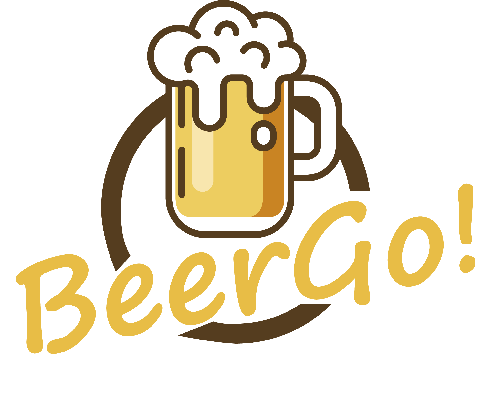

<p align="center">
  
</p>

# BeerGo!
App developed for solve the problem for Phoebus in Hackathon SolvIEEE it! Plus 2019

## Description

Vending machines is the new future, but have one problem, **how we can sell an alcoholic beverage and see if the buyer is a adult person?**. Now we havo to develop the visual identity for the product, the solution and the app to solve all with idea that we have. Let's go!!

## Installation

This project is dveloped using React Native.

Do the process to instal react-native-cli, node and NPM

[React Native](https://facebook.github.io/react-native/docs/getting-started)


After install the React Native CLI, node and NPM, you have to install Android studio in your machine, to install the Android Sdk to run the code in your emulator or pyshics smartphone.

[Download and install Android Studio](https://developer.android.com/studio/)

Now you have to configure the Android Sdk to your environment. edit **$HOME/.bashrc** and put this code into the file.

```
export ANDROID_HOME=$HOME/Android/Sdk
export PATH=$PATH:$ANDROID_HOME/emulator
export PATH=$PATH:$ANDROID_HOME/tools
export PATH=$PATH:$ANDROID_HOME/tools/bin
export PATH=$PATH:$ANDROID_HOME/platform-tools
```

Now you just have to run the .bashrc, **source .bashrc**.

## Run project

After all you have to enter in BeerGo folder, after this we have to run react-native.

```
react-native run-android or react-native run-ios
```

## Packages

```
    "firebase": "^5.8.3",
    "react": "16.6.3",
    "react-native": "0.58.4",
    "react-native-gesture-handler": "^1.0.15",
    "react-native-image-picker": "^0.28.0",
    "react-navigation": "^3.2.3"
```