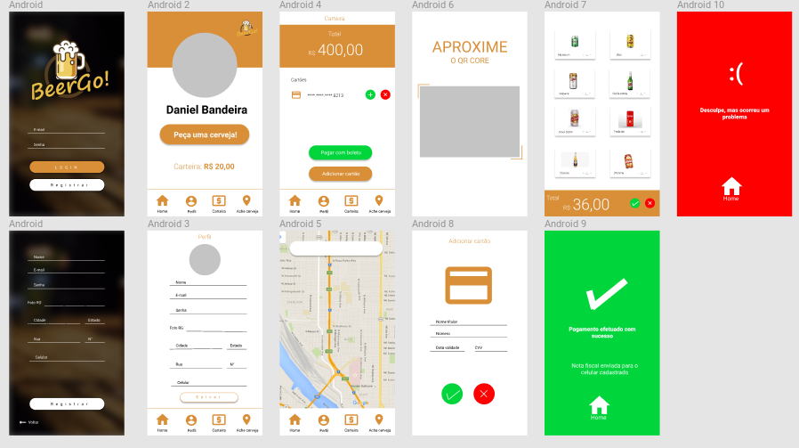

<p align="center">
  
</p>

# BeerGo!
App developed for solve the problem for Phoebus in Hackathon SolvIEEE it! Plus 2019

## Description

Vending machines is the new future, but have one problem, **how can we sell an alcoholic beverage and see if the buyer is a adult person?**. Now we have to develop the visual identity for the product, the solution and the app to solve all with idea that we have. Let's go!!

## Installation

This project was developed using React Native.

Do the process to instal react-native-cli, node and NPM

[React Native](https://facebook.github.io/react-native/docs/getting-started)


After install the React Native CLI, node and NPM, you have to install Android studio in your machine, to install the Android Sdk to run the code in your emulator or pyshics smartphone.

[Download and install Android Studio](https://developer.android.com/studio/)

Now you have to configure the Android Sdk to your environment. edit **$HOME/.bashrc** and put this code into the file.

```
export ANDROID_HOME=$HOME/Android/Sdk
export PATH=$PATH:$ANDROID_HOME/emulator
export PATH=$PATH:$ANDROID_HOME/tools
export PATH=$PATH:$ANDROID_HOME/tools/bin
export PATH=$PATH:$ANDROID_HOME/platform-tools
```

Now you just have to run the .bashrc, **source .bashrc**.

## Run project

After all you have to enter in BeerGo folder, after this we have to run react-native.

```
react-native run-android or react-native run-ios
```

## Packages

```
    "firebase": "^5.8.3",
    "react": "16.6.3",
    "react-native": "0.58.4",
    "react-native-gesture-handler": "^1.0.15",
    "react-native-image-picker": "^0.28.0",
    "react-navigation": "^3.2.3"
```

## Develop Process

# Research

At the first we have the problem about how we sell the products, how is our public and what we'll do for client come back. So about the beers, what is the highest price the customer want to pay for his beer?, in this step we build a spreadsheet to search the price of beers, to see how is the profit about 1 year, 5 years and 10 years.

Here you can see this profit [Planning](https://docs.google.com/spreadsheets/d/1w_cgNGFtSgNv0pcaqYGY_uetnW2xGwYtig1c7Vku3qM/edit?usp=sharing)

# Prototype
So, now we build a logo and the apresentation to sell our product, presenting the data from oue planning, about the UX Design and now we can prototype our app.

We used the [Figma](www.figma.com) to build our prototype plataform, we focus on [Material Design](https://material.io/design/) to develop in best UI experience to user, we build tests from usability and compare each protype, at the end we find this prototype:

<p align="center">
  
</p>

# Dev
at the end we start to develop our system using React Native, at this point we go finish soon, bye bye :) :dog:


# To do

- [x] Research process
- [x] Find the soluction
- [x] Protype
- [x] Connect with firebase
- [ ] Implement all frontend
- [ ] Implement all backend
- [ ] Fix bugs
